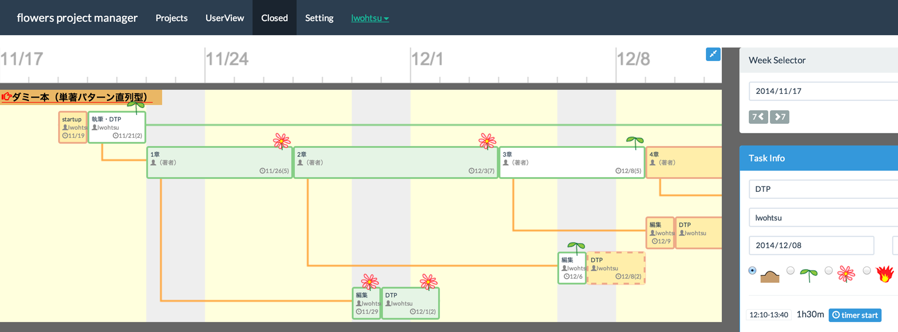
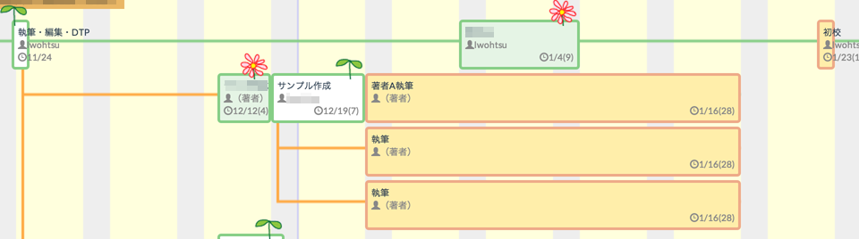

#flowers project manager

##description

リスケのしやすさを重視したWebアプリ型のプロジェクト管理ツールです。
こんな職場でのプロジェクト管理を想定しています。

- 1〜3ヶ月程度の期間で複数のプロジェクトが進行している
- 1人が複数のプロジェクトにアサインされる
- スケジュール変更が日常茶飯事
- 他の人が忙しいのか暇なのかよくわからない

プロジェクト内のタスク（1作業）は〆切りと期間を表しており、
動かす（〆切りが変動する）と子のタスクが一緒に動きます。

紙やExcelなどで作るプロジェクト表を操作できることだけをイメージで、
機能もなるべく減らしたので、使い方を覚えるのは簡単です。



一般的なプロジェクト管理ツールにあるような、
Issueを立てて問題を解決していくような機能はありません。

誰が忙しくて、誰の手が空いていて、どの工程が遅れていて、
その影響がどこに出るかがわかればいい人のためのツールです。


## how to install

### スタンドアロンで使う場合
一人で使う場合はMacかLinuxにMeteor（https://www.meteor.com/）を導入します。
※WindowsではMeteorの開発環境が動かないようです。

MacであればまずMeteorをインストールします。

```
$ curl https://install.meteor.com | /bin/sh
```

後はこのリポジトリのファイルを適当なフォルダ内にダウンロードし、
そこをカレントディレクトリとしてターミナルを開いて、
「meteor」というコマンドを実行します。

起動したらブラウザで「localhost:3000」に接続します。

新しく使うときはNav-barの「SignIn」からユーザー登録してください。

### 共同で使う場合
インターネット上に公開して複数ユーザーが利用できるようにするには、
Meteorを実行できるサーバ（Node.jsとMongoDBが動作するサーバ）が必要です。

「heroku meteor」で検索すると情報が見つかるので、チャレンジしてみてください。

クライアント側はWindowsでもMacでも何でも構いません。
iOSからも機能はひととおり利用できますが（Meteorがサポートしているので）、
大サイズで見る前提の画面設計なのでスマートフォンでは使い物になりません。

## 未実装の機能
- メモ機能（プロジェクトやタスクに簡単なメモを付ける機能）
- 工数タイマー（その作業にどれだけ時間がかかったかを記録しておく機能）


## 画面各部の説明

### Nav-bar
上部のバーです。

- Projects  
自分が参加している進行中のプロジェクトを一覧表示します。
- UserView  
特定のユーザーが担当しているタスクだけを表示します。
自分が近々やらなければいけないタスクを確認したい場合や、
手が空いている人を探したいときに使います。
- Closed  
完了したプロジェクトです。昔の仕事を見返したいときなどに使います。
- Setting  
ユーザーの名前や、バーチャルユーザーの登録を行います。
バーチャルユーザーは、flowersに実際のアカウントを持っていない人（クライアント・外注など）を
タスク管理に含めなければいけないときに使います。
- SignIn  
ログイン、ログアウト、ユーザー登録を行います。

### Timeline
日付が表示されている部分がタイムラインです。
仕事は週単位で管理することが多いので、月曜日の日付が表示されるようにしています。

タイムラインをクリックしてタスクが選択されていない状態にすると、
左右のカーソルキーで7日単位でスクロールできます。

サイドバーの「Week Selector」からも移動できます。

標準では約4週間（画面幅によって変動）が表示されていますが、
タイムライン右上の青いボタンをクリックすると約12週表示に切り替わります。

### ListArea
左側のリストエリアにはプロジェクトとタスクが表示されます。

- プロジェクト  
1つの仕事。左上にプロジェクト名が表示されます。
- タスク  
1つの作業。担当者と締め切り日が表示されます。
子のタスクとブランチのタスクを持たせることができます。
- タスクの色  
茶色（土）は未着手、緑枠に白地（双葉）は作業中、
緑枠に緑地（花）は完了、
赤枠（炎）はトラブルが起きて期限に間に合わないことを表します。
- タスクの移動  
タスクをクリックして選択すると、カーソルキーの左右で締め切り日を移動できます。
［Shift］キーと左右キーを同時に押すとタスクの幅（作業日数）を変更できます。
また、［alt］キーと左右キーを同時に押すと子タスクを連動させずにそのタスクだけを移動できます。
- スタートタスク  
プロジェクト作成時に最初からあるタスクで、削除できません。
- マスターブランチ  
一番上の行のタスクはマスターブランチと呼び、特別扱いにしています。
実際の作業ではなく「準備期間」「執筆」「初校」「再校」といった
マイルストーンを表すために使うことをおすすめします。
- ブランチ  
並行して作業を進めたいときはブランチ（分岐）のタスクを追加します。
親のタスクと連動して動かすことができます。

ブランチは同時に並行して進められる作業、
子タスクは親タスクが終わらないと進められない作業を表すのが基本です。

以下の図は3人の著者が並行して共著するパターンで、
親タスクのサンプル作成が終わらないと着手できません。




どちらも親タスクと連動して移動できるので、状況に応じて
